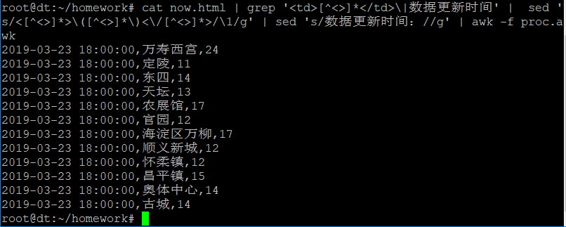

# 作业1：正则表达式应用

## 题目要求

从因特网上搜索相关Web网页，处理网页html数据，从中提取出当前时间点北京各监测站的PM2.5浓度，输出格式如下。

2018-03-15 13:00:00,海淀区万柳,73
2018-03-15 13:00:00,昌平镇,67
2018-03-15 13:00:00,奥体中心,66
2018-03-15 14:00:00,海淀区万柳,73
2018-03-15 14:00:00,昌平镇,73
2018-03-15 14:00:00,奥体中心,75

要求：写出各个处理步骤，并给出解释。

## 解

目标网站：http://pm25.in/beijing

使用`wget http://pm25.in/beijing -q -O now.html`下载网页到now.html文件中

保存如下内容到文件proc.awk中：

```awk
NR == 2 { time = $1" "$2 }
NR % 10 == 3 { location = $1 }
NR % 10 == 7 { printf("%s,%s,%s\n", time, location, $1) }
```

使用如下指令即可输出目标结果：

```
cat now.html | grep '<td>[^<>]*</td>\|数据更新时间' |  sed 's/<[^<>]*>\([^<>]*\)<\/[^<>]*>/\1/g' | sed 's/数据更新时间：//g' | awk -f proc.awk
```

输出截图：



## 操作分析

1. 使用`wget`的`-O`参数下载网页到目标文件now.html中
2. 使用`cat`指令输出网页

网页中的有关日期时间的信息：


有关地点与pm2.5的信息：


3. 使用`grep`指令，根据`<td>`标签抓取网页文件中的表格数据，根据“数据更新时间”关键字抓取日期。输出的第一行和第二行都包括日期信息。后面是带有HTML标签的表格数据


4. 使用`sed`指令，删除所有html标签


5. 使用`sed`指令，删除“数据更新时间：”，此时第二行剩下形如“2019-03-23 18:00:00”的日期（但是前面有很多空格）


6. 使用`awk`指令，调用文件proc.awk中的程序
7. NR为2时根据步骤5可以知道此行是前面有很多空格的日期。使用`$1" "$2`提取非空格部分并使用一个空格拼接，赋值给变量time以便后面的输出
8. NR除10余3时行的内容为监测点名称，保存到变量location
9. NR除10余7时行的内容为PM2.5浓度，使用`printf`函数格式化输出结果即可


