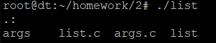
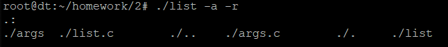
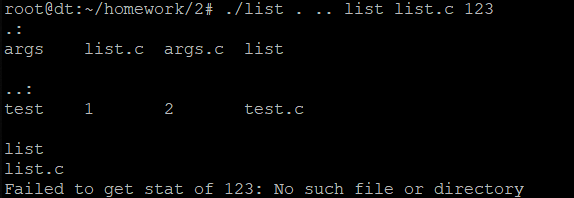
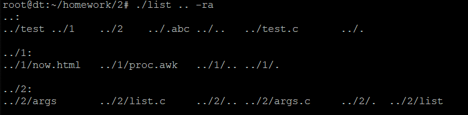
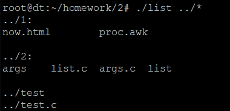
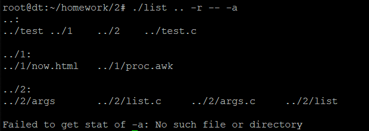
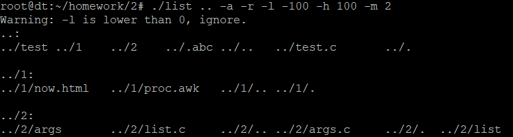

# 作业二 - 遍历目录

## 题目

### 要求

- 编程实现程序list.c，列表普通磁盘文件，包括文件名和文件大小。
- 使用vi编辑文件，熟悉工具vi。
- 使用Linux的系统调用和库函数。
- 体会Shell文件通配符的处理方式以及命令对选项的处理方式。
- 对选项的处理，自行编程逐个分析命令行参数。不考虑多选项挤在一个命令行参数内的情况

处理对象：
- 与ls命令类似，处理对象可以有0到多个
- 0个：列出当前目录下所有文件
- 普通文件：列出文件
- 目录：列出目录下所有文件

实现自定义选项r,a,l,h,m以及--
- r 递归方式列出子目录（每项要含路径，类似find的-print输出风格，需要设计递归程序）
- a 列出文件名第一个字符为圆点的普通文件（默认情况下不列出文件名首字符为圆点的文件）
- l 后跟一整数，限定文件大小的最小值（字节）
- h 后跟一整数，限定文件大小的最大值（字节）
- m 后跟一整数n，限定文件的最近修改时间必须在n天内
- --显式地终止命令选项分析

### 提示与实例

编辑，编译
- `vi list.c`
- `make list` 或者 `gcc list.c –o list`

运行举例
- `./list –l 100 –h 5000 /bin /etc`列出大小在100~5000之间的文件
- `./list –a -r -l 50000 –m 2`递归式列出当前目录树下大小超50KB且2天内修改过的文件（包括文件名首字符为圆点的文件）
- `./list -- -l`
- `./list *`

### 延伸学习

用于处理命令选项的库函数getopt_long，用这个函数重新设计选项处理部分，设计长短格式选项。体会这个库函数功能的设计思想

### 参考函数

```c
#include <stdio.h>
#include <dirent.h>
#include <sys/stat.h>

/* 获取路径名path对应的i节点中的属性*/
struct stat st;

ret =stat(path,&st);

/* 判断i节点属性为目录*/
if(S_ISDIR(st.st_mode)){
	...
}
```

## 解

### 思路

使用getopt函数进行命令行选项解析。因为题目仅涉及短选项，故并没有使用getopt_long函数。设置选项字符串为`ral:h:m:`。

设置全局变量config保存命令行参数的影响，config数据结构为一个匿名struct，包含`r/a/l/m/h`五个整型变量。`r`和`a`的取值仅为0或1，表示是否有`-a/-r`选项。`l/h/m`取值小于等于0时视为无效。

程序启动后首先使用getConfig函数，调用getopt函数对命令行参数进行处理，给config赋值，重排序argv，并把optind指向第一个实参。如果第一个实参为`--`则忽略。然后调用printItem函数进行输出。

printItem函数会获取目标path的stat。如果文件或目录不存在则输出错误信息并返回。如果存在且为文件夹则调用printDir函数。如果是文件则输出文件名（忽略`-a/-r`选项）。

printDir函数会调用openDir打开指定path的目录，遍历目录项，打印目录。打印结束后判断`-r`选项是否被选中，如果用户提供了`-r`选项，则再次遍历目录项，递归调用printDir函数依次输出除了`.`和`..`以外的目录

因为使用了getopt函数，所以可以实现：
- 参数重排序。getopt会把参数进行重排序，把命令行选项放在前面，实参放在后面
- 终止选项分析。getopt会在参数重排序后把`--`放在第一个实参的位置。getopt也会把`--`后面的选项视为实参，终止分析
- 选项整合。getopt函数支持多个命令行参数挤在一个命令行参数中，如`-ar`

选项`-m`判断是时间是ctime

### 代码实现

```c
#include <stdio.h>
#include <stdlib.h>
#include <dirent.h>
#include <sys/stat.h>
#include <getopt.h>
#include <unistd.h>
#include <time.h>
#include <string.h>

static const char *optString = "ral:h:m:";
static const int MAX_PATH_LENGTH = 255;

struct
{
	int r; // 0 for false, 1 for true
	int a; // 0 for false, 1 for true
	int l;
	int h;
	int m;
} config;

time_t now;
struct stat buf;

void getConfig(int argc, char **argv);
void printItem(char *path);
void printDir(char *path);
int judgeMLH();

int main(int argc, char **argv)
{
	int i;
	time(&now);

	getConfig(argc, argv);

	if (optind >= argc) // print current dir
		printItem(".");
	else
	{
		if (!strcmp(argv[optind], "--"))
			optind++; // ignore the first '--'
		for (i = optind; i < argc; ++i)
			printItem(argv[i]);
	}

	return 0;
}

void printItem(char *path)
{
	if (stat(path, &buf))
	{
		printf("Failed to get stat of %s: %m\n", path);
		return;
	}

	if (S_ISDIR(buf.st_mode))
	{
		printf("%s:\n", path);
		printDir(path);
	}
	else if (judgeMLH())
		// ignore config.a and config.r
		printf("%s\n", path);
}

int judgeMLH()
{
	if ((config.m <= 0 || now - buf.st_ctime < config.m * 60 * 60 * 24) 
	&& (config.l <= 0 || buf.st_size >= config.l)
	&& (config.h <= 0 || buf.st_size <= config.h))
		return 1;
	else
		return 0;
}

void printDir(char *path)
{
	DIR *dir = opendir(path);
	if (!dir)
	{
		printf("Failed open dir %s: %m", path);
		return;
	}

	struct dirent *item;
	char fullPath[MAX_PATH_LENGTH];

	while (item = readdir(dir))
	{
		// hide dirs and files start with '.'
		if (!config.a && item->d_name[0] == '.')
			continue;

		if (config.r)
		{
			// print full path
			strcpy(fullPath, path);
			if (fullPath[strlen(fullPath) - 1] != '/')
				strcat(fullPath, "/");
			strcat(fullPath, item->d_name);
			printf("%s\t", fullPath);
		}
		else
			printf("%s\t", item->d_name);
	}
	printf("\n\n");

	if (config.r)
	{
		// print dir recursively
		rewinddir(dir);
		while (item = readdir(dir))
		{
			// still hide dirs and files start with '.'
			if (!config.a && item->d_name[0] == '.')
				continue;

			// ignore . and ..
			if (item->d_type == DT_DIR && strcmp(item->d_name, ".") && strcmp(item->d_name, ".."))
			{
				// get dir path and print
				strcpy(fullPath, path);
				if (fullPath[strlen(fullPath) - 1] != '/')
					strcat(fullPath, "/");
				strcat(fullPath, item->d_name);
				printf("%s:\n", fullPath);
				printDir(fullPath);
			}
		}
	}

	closedir(dir);
}

void getConfig(int argc, char **argv)
{
	// init config
	config.r = 0;
	config.a = 0;
	config.l = 0;
	config.h = 0;
	config.m = 0;

	int i;

	int opt;
	while ((opt = getopt(argc, argv, optString)) != -1)
	{
		switch (opt)
		{
		case 'r':
			config.r = 1;
			break;
		case 'a':
			config.a = 1;
			break;
		case 'l':
			config.l = atoi(optarg);
			if (config.l <= 0)
				printf("Warning: -l is lower than 0, ignore.\n");
			break;
		case 'h':
			config.h = atoi(optarg);
			if (config.h <= 0)
				printf("Warning: -h is lower than 0, ignore.\n");
			break;
		case 'm':
			config.m = atoi(optarg);
			if (config.m <= 0)
				printf("Warning: -m is lower than 0, ignore.\n");
			break;
		default:
			break;
		}
	}
}
```

### 运行效果

没有实参，输出当前目录



没有实参，提供命令行选项



有多个实参



有多个实参并提供命令行选项



使用文件通配符



显式终止选项分析



条件判断


