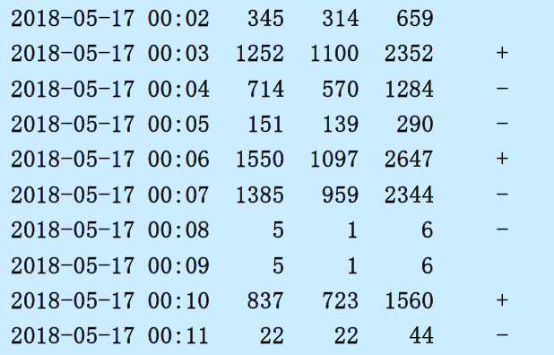
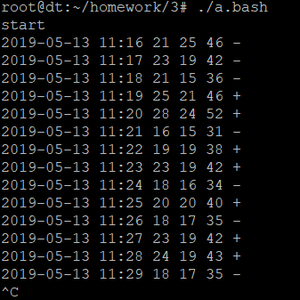

# 作业3-shell脚本编程

## 题目

目标 - 生成TCP活动状况报告

netstat --statistics --tcp命令可以列出tcp统计信息。编写shell脚本程序，每隔1分钟生成1行信息：
- 当前时间
- 这一分钟内TCP发送了多少报文
- 接收了多少报文
- 收发报文总数
- 行尾给出符号+或-或空格（+表示这分钟收发报文数比上分钟多，收发报文数相同用空格，否则用符号-）。

运行示例如下：



## 解

定义了如下变量：
- previousReceivedRecord/currentReceivedRecord - 记录一分钟前和当前TCP接收总量
- previousSentRecord/currentSentRecord - 记录一分钟前和当前TCP发送总量
- previousReceived/currentReceived - 上一分钟和这一分钟TCP接收总量
- previousSent/currentSent - 上一分钟和这一分钟TCP发送量
- previousTotal/currentTotal - 上一分钟和这一分钟TCP发送和接收总量
- state - 判断previousTotal和currentTotal得到的状态，可能的值是`+`/`-`和空格

定义了函数`getCurrentTCP`计算以上变量的值。函数中使用`netstat --statistics --tcp`捕获数据，使用`egrep '(segments received|segments sent out)`抓取TCP的发送和接收数据（有一条多余的数据），使用`awk 'NR==1||NR==2{printf("%s ), $1}'`整理数据，然后把数据重定向到`read`指令获取变量值。

使用`date "+%F %H:%M"`格式化输出日期时间（精确到分钟）。

使用`sleep`指令实现每隔一分钟输出一次。因为第一分钟不输出，所以输出start进行提示。

## 运行截图



## 代码

```sh
#!/bin/bash

# define utility function
getCurrentTCP() {
  # record previous variables
  previousReceivedRecord=$currentReceivedRecord
  previousSentRecord=$currentSentRecord
  previousTotal=$currentTotal

  # get new value of current record
  read currentReceivedRecord currentSentRecord \
		<<< `netstat --statistics --tcp \
		| egrep '(segments received|segments sent out)' \
		| awk 'NR==1||NR==2{printf("%s ", $1)}'`

  # calculate current virables
  currentReceived=`expr $currentReceivedRecord - $previousReceivedRecord`
  currentSent=`expr $currentSentRecord - $previousSentRecord`
  currentTotal=`expr $currentSent + $currentReceived`

  # judge state
  if [ $currentTotal -gt $previousTotal ]
  then
    state="+"
  elif [ $currentTotal -lt $previousTotal ]
  then
    state="-"
  else
    state=""
  fi
}

# set initial values
currentReceivedRecord=0
currentSentRecord=0
currentReceived=0
currentSent=0
currentTotal=0

# get initial value
getCurrentTCP

# show tip
echo start

while true
do
  sleep 1m
  getCurrentTCP
  echo `date "+%F %H:%M"` $currentSent $currentReceived $currentTotal $state
done
```